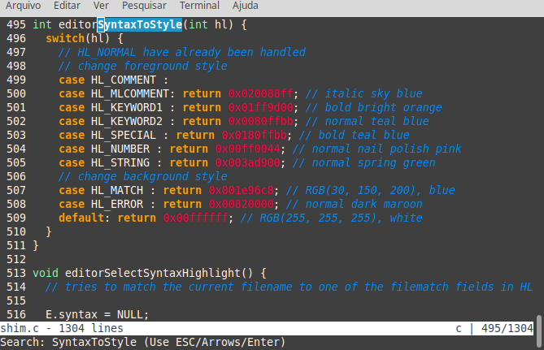

# Shim editor
a simple terminal-based text editor written in C from scratch, that takes advantages of the capabilities of modern terminals and comes with minimal dependency requirements (it's not even using **curses**).


It now supports:

- open & save (one file at a time)
- read and write files in text format
- scrolling
- incremental search
- syntax highlighting

## Installation

### Compiling

```shell
$ git clone https://github.com/tonisidneimc/shim
$ cd shim/
$ make install
```

### Running

To create and edit a new file, run shim with no command-line arguments, as follows:

```shell
$ shim
```

Or to edit and existing file, provide the absolute or relative path to the file:

```shell
$ shim /path/to/your/file
```

## Images





## Acknowledge

Thanks to [antirez](https://github.com/antirez) and his tutorial [Build your own Text Editor](https://viewsourcecode.org/snaptoken/kilo/) for inspiring me with his project [kilo](https://github.com/antirez/kilo/).


